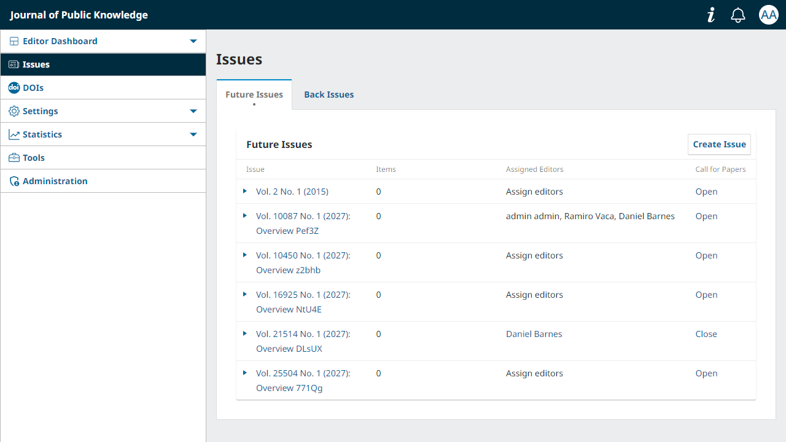
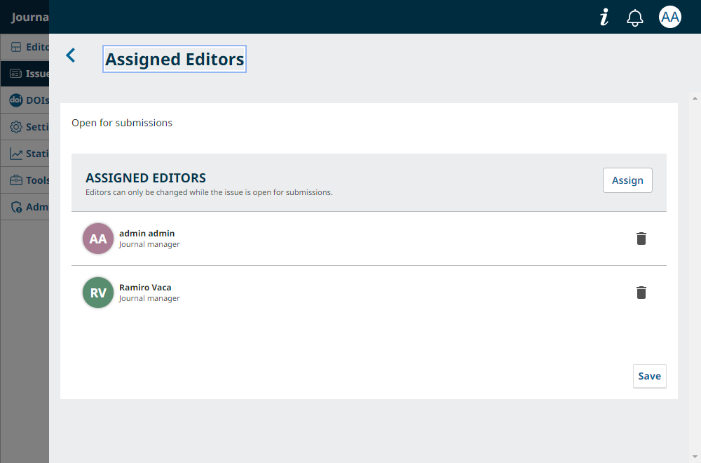
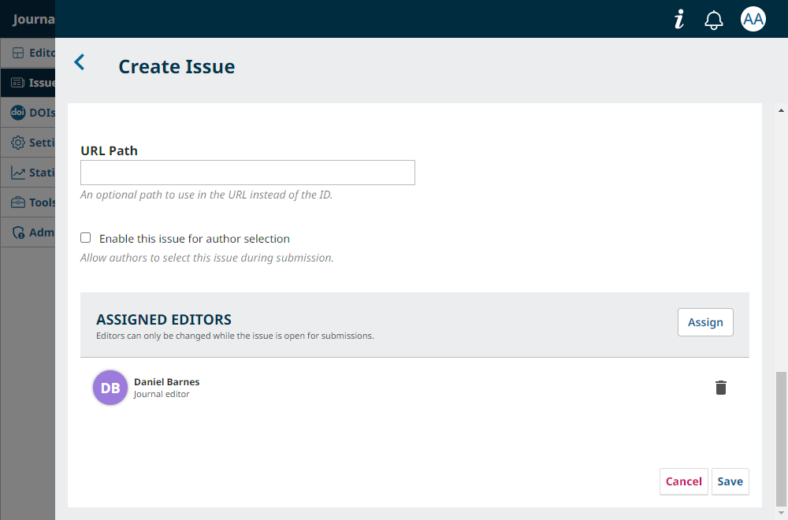
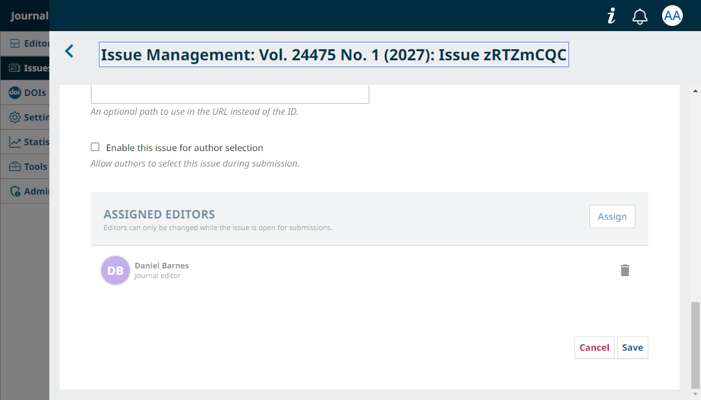
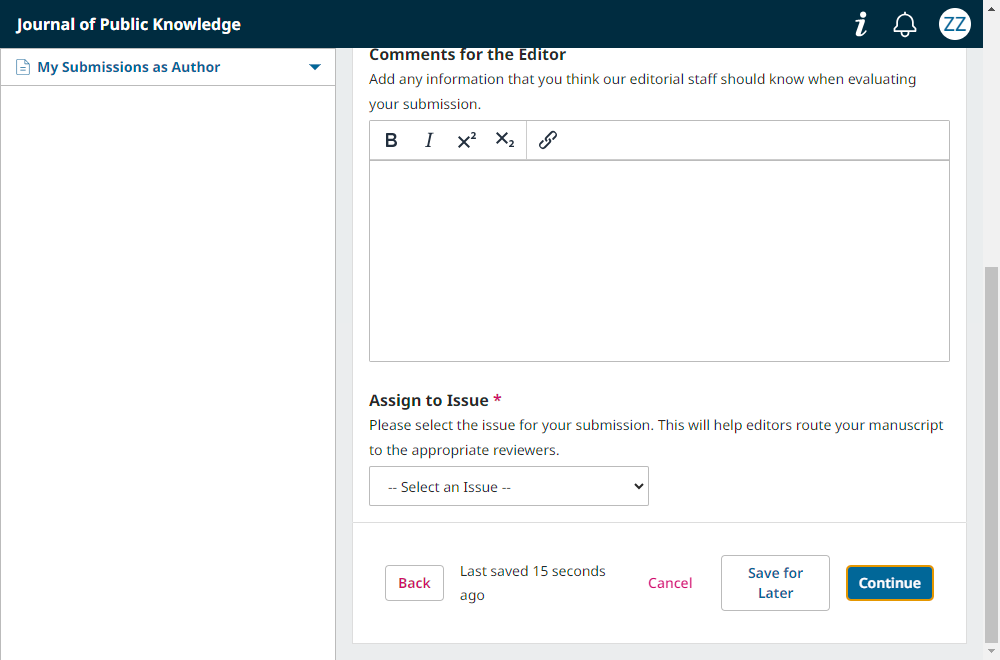

# Issue Preselection Plugin for OJS 3.5+

[](https://github.com/abenteuerzeit/issuePreselection/releases)
[](https://pkp.sfu.ca/ojs/)
[](LICENSE)

## Table of Contents

- [Overview](#overview)
- [Features](#features)
- [Requirements](#requirements)
- [Installation](#installation)
- [Configuration](#configuration)
  - [Setting Up Issues](#setting-up-issues)
  - [Author Submission Workflow](#author-submission-workflow)

- [Technical Details](#technical-details)
- [Development](#development)
- [Support](#support)
- [Contributing](#contributing)
- [License](#license)

## Overview

The Issue Preselection Plugin allows authors to select which journal issue their
submission should be assigned to during the submission process. Editors can
configure which issues are open for submissions and pre-assign guest editors who
will automatically be assigned to incoming submissions.

## Features

### For Authors

- **Issue Selection During Submission** - Select from available future issues
  when submitting
- **Direct Response to Calls for Papers** - Submit directly to specific themed
  issues
- **Filtered Issue List** - Only see issues that editors have marked as open

### For Editors

- **Issue Configuration** - Mark issues as open/closed for author selection
- **Editor Pre-assignment** - Assign guest editors to issues for automatic
  workflow assignment
- **Automatic Workflow** - Submissions automatically assigned to configured
  editors with notifications

## Requirements

- **OJS Version**: 3.5.0.1 or higher
- **PHP Version**: 8.2 or higher
- **Database**: MySQL 5.7+ or PostgreSQL 9.5+

## Installation

### Method 1: Manual Installation

1. Download the latest release from the
   [releases page](https://github.com/abenteuerzeit/ojs-issue-preselection/releases)
2. Extract the archive
3. Copy the `issuePreselection` folder to `plugins/generic/` in your OJS
   installation
4. Log in to OJS as Administrator
5. Navigate to **Settings > Website > Plugins**
6. Find "Issue Preselection Plugin" under Generic Plugins
7. Click **Enable**

### Method 2: Git Installation

```bash
cd /path/to/ojs/plugins/generic
git clone https://github.com/abenteuerzeit/ojs-issue-preselection.git issuePreselection
```

Then enable via the OJS admin interface as described above.

## Configuration

### Setting Up Issues

#### Step 1: Navigate to Future Issues

Navigate to **Issues > Future Issues**.



#### Step 2: Create or Edit an Issue

Click **Create Issue** or edit an issue you want to configure.



**Edit** is shown after expanding the view by clicking on the triangular bullet
to the left of the issue. You can also click on the name directly.

For a new issue, editors can be assigned before the first save:



#### Step 3: Configure Issue Data

You'll see two new fields under **Issue Data**.



- **Enable for Submission**: Check to make this issue available for author
  selection.
- **Assigned Editors (Optional)**: Select one or more editors to automatically
  assign to submissions.

> Updates to editor assignments under the issue data tab apply to all active
> submissions assigned to an issue and not scheduled for publication.

#### Step 4: Save Changes

Click **Save**.

### Author Submission Workflow

#### Step 1: Start New Submission

Author clicks "New Submission".

#### Step 2: View Issue Selection

In the "For the Editors" step, they see an "Issue Selection" dropdown.



#### Step 3: Select Target Issue

Author selects the target issue.


#### Step 4: Validation - Missing Issue Selection

If the author does not select an issue, an error notification appears.


#### Step 5: Navigation - Back Button

On clicking Back.


#### Step 6: Validation - Success

Successful validation.


#### Step 7: Publication Scheduled

Upon submission, publication is scheduled to the selected issue.


#### Step 8: Guest Editors Added

All pre-assigned editors are added as Guest Editors.


#### Step 9: Notifications Sent

Editors receive notifications.

## Technical Details

### Architecture

The plugin uses OJS's hook system exclusively for integration:

- **Schema Hooks**: Extend issue and submission schemas with custom fields
- **Form Hooks**: Add UI elements to issue and submission forms
- **Template Hooks**: Display selected issue in review section
- **Validation Hooks**: Process issue assignment and editor assignment on
  submission

### Data Storage

Uses OJS's existing settings tables (no database migrations required):

- `issue_settings`: Stores `isOpen` (boolean) and `editedBy` (array of user IDs)
- `submission_settings`: Stores `preselectedIssueId` (integer)
- `publications`: Uses existing `issueId` field for scheduling

### Hooks Used

- `Schema::get::issue` — Add custom fields to issue schema.
- Templates::Editor::Issues::IssueData::AdditionalMetadata — Extend the issue
  form.
- `issueform::readuservars` — Register custom form variables.
- `issueform::execute` — Save custom issue settings.
- `Issue::edit` — Preserve custom data during edits.
- `Schema::get::submission` — Add `preselectedIssueId` to the submission schema.
- `Form::config::after` — Add the issue selector to the submission wizard.
- Template::SubmissionWizard::Section::Review::Editors — Display the issue in
  the review section.
- `Submission::validateSubmit` — Process issue assignment on submission.

## Development

The repository includes a Docker-based OJS 3.5 development environment.

### Development Requirements

- Docker
- Docker Compose
- Node.js and npm

### Environment Setup

Create a `.env` file in the project root before starting Docker. The compose
file reads the database and URL settings from this file.

```dotenv
MYSQL_ROOT_PASSWORD=rootpassword
MYSQL_DATABASE=ojs
MYSQL_USER=ojsuser
MYSQL_PASSWORD=ojspassword

OJS_DB_HOST=db
OJS_DB_USER=ojsuser
OJS_DB_PASSWORD=ojspassword
OJS_DB_NAME=ojs
OJS_BASE_URL=http://localhost
```

If you do not want to change the defaults, you can reuse the existing `.env`
file in this repository.

### Start the Development Environment

Build and start OJS with MariaDB:

```bash
npm start
```

This builds the OJS container, starts the database, and sets the required file
permissions.

OJS is available at:

```text
http://localhost
```

The Docker environment provides:

- OJS 3.5.0
- PHP 8.2
- MariaDB 10.5
- Node.js 20
- Cypress
- Persistent Docker volumes for the database and OJS files

### Docker Commands

Build and start the containers:

```bash
npm run build:docker
```

Reset and rebuild the containers:

```bash
npm run reset:docker
```

The reset command removes and recreates the containers but preserves Docker
volumes, including the database.

Set OJS file permissions:

```bash
npm run set:permissions
```

### Testing

The plugin includes Cypress end-to-end tests.

Run the tests:

```bash
npm test
```

The issue-management tests are split by scope:

- `cypress/tests/functional/IssueOverview.cy.js` covers the Future Issues grid
  and editor-assignment controls.
- `cypress/tests/functional/IssueDataForm.cy.js` covers issue form behavior,
  creation-time assignments, and persistence.

README screenshots are stored in `docs/images/`. Cypress screenshots and failure
logs are generated under `cypress/`.

Open Cypress interactively:

```bash
npm run test:open
```

### Formatting

Format the plugin source:

```bash
npm run format
```

### Adding Translations

1. Copy `locale/en/locale.po` to `locale/{locale_code}/locale.po`
2. Translate the strings
3. Submit a pull request

### Debugging

Enable error logging in `config.inc.php`:

```ini
[debug]
show_stacktrace = On
display_errors = On
```

OJS and Apache logs can be inspected with:

```bash
docker compose -f docker/docker-compose.yaml logs -f ojs
```

For the error log specifically:

```bash
docker compose -f docker/docker-compose.yaml exec ojs tail -f /var/log/apache2/error.log
```

The plugin logs extensively with `[IssuePreselection]` prefix.

## Support

- **Issues**:
  [GitHub Issues](https://github.com/abenteuerzeit/ojs-issue-preselection/issues)
- **Documentation**:
  [Wiki](https://github.com/abenteuerzeit/ojs-issue-preselection/wiki)
- **OJS Forum**: [PKP Community Forum](https://forum.pkp.sfu.ca/)

## Contributing

Contributions are welcome! Please:

1. Fork the repository
2. Create a feature branch
3. Make your changes
4. Submit a pull request

## License

This plugin is licensed under the GNU General Public License v3.0. See
[LICENSE](LICENSE) for details.
